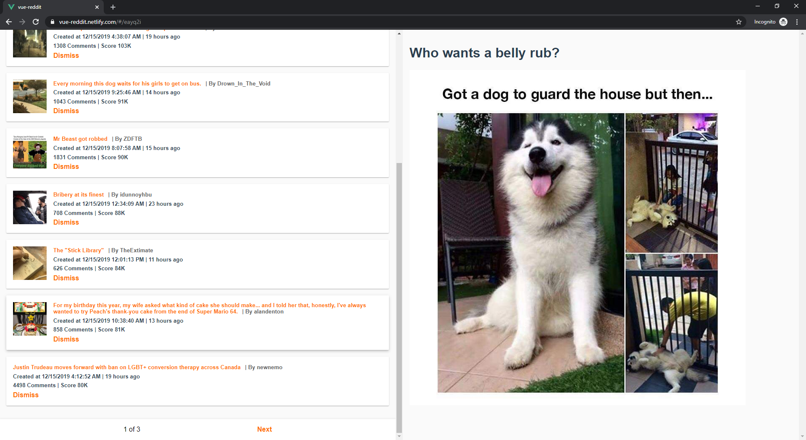
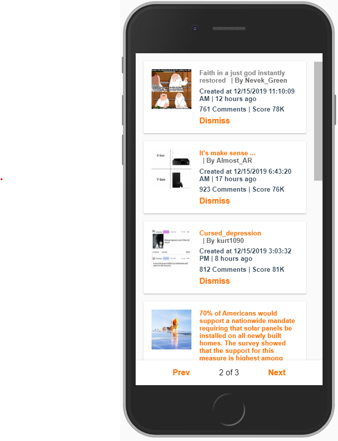

# vue-reddit | [Live Version](https://vue-reddit.netlify.com/)

A minimal Vue Wrapper around Reddit's Top popular post page (https://reddit.com/top) built with the Vue stack as a timed challenge under 5 hours.

### Features

- Local Storage Peristence
- Keeps track of read posts
- Allows dismissing posts to hide them
- Pagination Support (10 by default)
- Responsive Design




### Tech Used

- Vue
- Vue Router
- Vuex

Might update to use the Vue 3 Composition API for cleaner reactivity and less boilerplate later, but left as is as the point of this exercise was to demonstrate how Vue/Router/Vuex state management interact with each other.

### TODOs

Most issues pending are minor, but weren't fixed as this was built under timer constraints.

- Vue transition animations were taken out as they weren't working reliably for all edge case transitions for some reason, so they were taken out in favor of a more consistent user experience.
- Dismiss all button was taken out, though it should be easy to implemement with a minor variation of the current dismiss functionality. This would go better with an extra button to un-hide all dismiss elements.
- Pagination bar needs to be made sticky on mobile and desktop, and adapt to variable column size.
- Responsive Design could be better, a swipeable sidebar could be easly implemented with [Slideout.js](https://slideout.js.org/)

## Project setup

```
npm install
```

### Compiles and hot-reloads for development

```
npm run serve
```

### Compiles and minifies for production

```
npm run build
```

### Lints and fixes files

```
npm run lint
```
